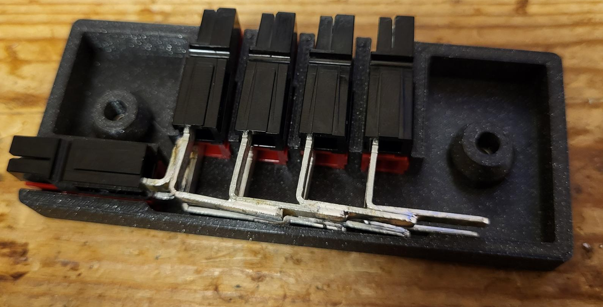

# Powerpole Distribution Box

A 3D printable Powerpole distribution box.

The box consists out of two 3D printable parts `upper.stl` and `lower.stl`. The idea is based on the parametric break-out box designed by the [W5YM](https://www.thingiverse.com/thing:423657) team. The snap mechanism of the original version is replaced by two screws which are recessed in the two-piece housing. The parts `upper_solder.stl` and `lower_solder.stl` can be used for easier soldering of the Powerpole contacts.

The model is made with Solid Edge 2021 in its Community Edition.

## BOM

- 1x Part `lower.stl`
- 1x Part `upper.stl`
- 5x Powerpole PP15/45 Housing Red (MPN 1327-BK)
- 5x Powerpole PP15/45 Housing Black (MPN 1327G6-BK)
- 10x Powerpole PCB Contact (MPN 1337G1)
- 2x Socket Head Screw M4x16mm
- 2x Hex Nut M4

## License

[Creative Commons Attribution 4.0 International (CC BY-NC-SA 4.0)](https://creativecommons.org/licenses/by-nc-sa/4.0/)